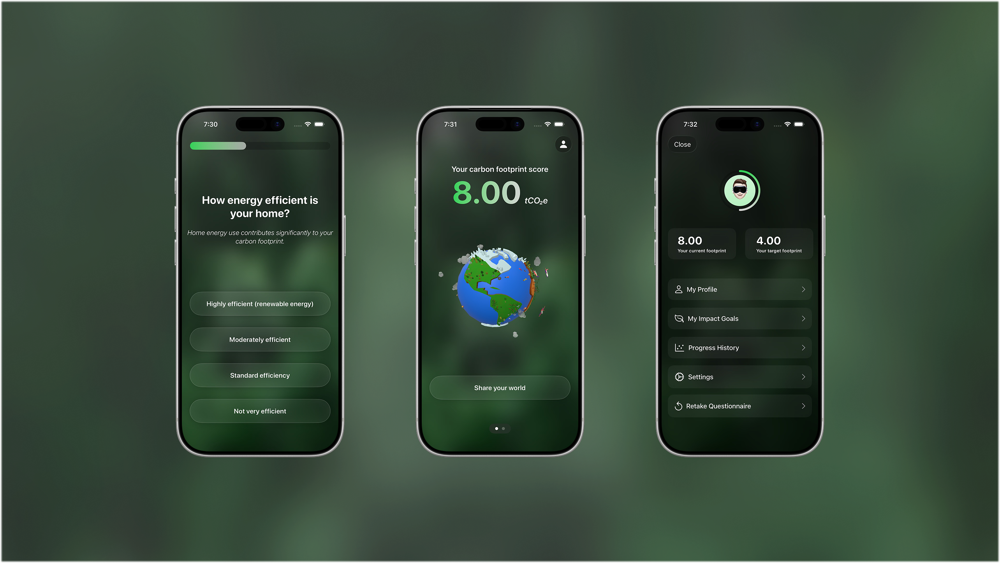

# EcosphereUI

Ecosphere is a calm, nature-inspired companion that helps people understand, track, and improve their carbon footprint. It begins with a simple questionnaire about daily habits. From food choices to transportation, each answer contributes to a clear, meaningful estimate of the user’s environmental impact.

Instead of presenting this impact through numbers alone, Ecosphere expresses it visually through a dynamic 3D model of the Earth that evolves based on the user’s lifestyle. This world becomes a personal reflection of their habits. It can grow healthier as progress is made or show areas of concern that need attention. The user’s Earth is not just a data point. It is a living, shareable representation of their footprint.

Sharing the world is a central part of the experience. With one tap, users can show their own Earth to friends, encouraging conversations around sustainability and motivating others to begin their own journey. A single visual can communicate impact far more effectively than raw metrics alone, and sharing makes progress feel communal rather than solitary.

Users can set a goal for themselves, track improvement over time, and retake the questionnaire whenever their habits change. Ecosphere supports them along the way with personalized tips tailored to their lifestyle. These tips appear as gentle cards that highlight simple, realistic steps they can take to reduce their footprint, offering guidance rather than judgment.

The UI draws heavily from nature. Soft forest greens and gentle depth effects create the feeling of a quiet forest. Buttons and surfaces float lightly on top of blurred organic textures, reinforcing a sense of calm rather than urgency. The visual language encourages reflection and awareness rather than pressure.

A defining part of the interface is a custom translucent material that powers the buttons and cards across the app. This material was created entirely in SwiftUI, and it became a signature element of Ecosphere. The effect is lightweight, responsive, and organic, giving the UI a modern feel while staying rooted in the natural theme.

Ecosphere brings together data, 3D visualization, and thoughtful interface design to make sustainability feel personal, approachable, and meaningful. It transforms environmental awareness from an abstract number into something users can see, understand, and share.

The Experience

Ecosphere guides the user through a calm, structured journey, beginning with self-assessment and ending with visual insight and actionable guidance. Each screen is designed to feel grounded, gentle, and rooted in nature.

The Questionnaire Flow

The experience begins with a lifestyle questionnaire. Each question is presented with a clear title and a supporting subtitle. The title states the question directly. The subtitle explains how that specific aspect of the user’s life influences their carbon footprint, helping them understand the why behind every choice they make.

Below the text, users choose from a set of large, glassy option buttons. These options are easy to tap and blend naturally with the forest-inspired background. At the top of the screen, a slim progress bar advances with each answer, giving users a sense of momentum without adding pressure.

This flow sets the tone for the entire app - calm, informative, and focused on awareness rather than judgment.
